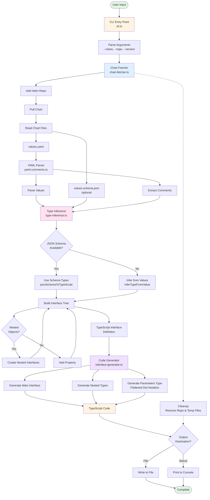

# @homelab/helm-types

Module authored by AI. Appears correct but not thoroughly reviewed.

Generate TypeScript types from Helm chart values.

## Overview

A library for fetching Helm charts and generating strongly-typed TypeScript interfaces from their
`values.yaml` and `values.schema.json` files.

**Key Features:**

- Fetch charts from any Helm repository
- Parse YAML comments for JSDoc documentation
- Generate nested interfaces with proper types
- Support for arrays, unions, enums, and optional properties
- Handle reserved keywords and special characters

## Installation

```bash
bun install
```

## Quick Start

### Using the CLI with bunx

The fastest way to generate types is using the CLI with `bunx`:

```bash
# Generate types for ArgoCD
bunx @homelab/helm-types \
  --name argo-cd \
  --repo https://argoproj.github.io/argo-helm \
  --version 8.3.1 \
  --output argo-cd.types.ts

# Or use short flags
bunx @homelab/helm-types \
  -n argo-cd \
  -r https://argoproj.github.io/argo-helm \
  -v 8.3.1 \
  -o argo-cd.types.ts

# Print to stdout (useful for piping)
bunx @homelab/helm-types \
  -n argo-cd \
  -r https://argoproj.github.io/argo-helm \
  -v 8.3.1

# Customize interface name
bunx @homelab/helm-types \
  -n argo-cd \
  -r https://argoproj.github.io/argo-helm \
  -v 8.3.1 \
  -i CustomArgocdValues \
  -o argo-cd.types.ts
```

**CLI Options:**

- `--name, -n` - Unique identifier for the chart (required)
- `--chart, -c` - Chart name in repository (defaults to --name)
- `--repo, -r` - Helm repository URL (required)
- `--version, -v` - Chart version (required)
- `--output, -o` - Output file path (defaults to stdout)
- `--interface, -i` - Interface name (auto-generated if not provided)
- `--help, -h` - Show help message

### Using as a Library

```typescript
import { fetchHelmChart, convertToTypeScriptInterface, generateTypeScriptCode } from "@homelab/helm-types";

// 1. Define your chart
const chart = {
  name: "argo-cd",
  chartName: "argo-cd",
  repoUrl: "https://argoproj.github.io/argo-helm",
  version: "8.3.1",
};

// 2. Fetch and generate types
const { values, schema, yamlComments } = await fetchHelmChart(chart);
const tsInterface = convertToTypeScriptInterface(values, "ArgocdHelmValues", schema, yamlComments);
const code = generateTypeScriptCode(tsInterface, chart.name);

// 3. Write output
await Bun.write("argo-cd.types.ts", code);
```

## API

### `fetchHelmChart(chart: ChartInfo)`

Fetches a Helm chart and extracts configuration.

```typescript
type ChartInfo = {
  name: string; // Unique identifier
  chartName: string; // Chart name in repo
  repoUrl: string; // Helm repository URL
  version: string; // Chart version
};

// Returns
{
  values: Record<string, unknown>;
  schema: JSONSchemaProperty | null;
  yamlComments: Map<string, string>;
}
```

### `convertToTypeScriptInterface(values, name, schema?, comments?, prefix?)`

Converts Helm values to TypeScript interface definition.

**Parameters:**

- `values` - Chart values object
- `name` - Interface name
- `schema?` - Optional JSON schema for validation
- `comments?` - Optional YAML comments for JSDoc
- `prefix?` - Optional key prefix for nested types

### `generateTypeScriptCode(interface, chartName)`

Generates TypeScript code from interface definition.

**Returns:** String containing:

- Main values interface
- Nested type definitions
- Flattened parameters type

### `parseYAMLComments(yamlContent)`

Extracts YAML comments and associates them with keys.

## Generated Output

### Values Interface

```typescript
export type ArgocdHelmValues = {
  /**
   * Number of replicas
   * @default 1
   */
  replicaCount?: number;

  image?: ArgocdHelmValuesImage;
  service?: ArgocdHelmValuesService;
};
```

### Nested Types

```typescript
export type ArgocdHelmValuesImage = {
  repository?: string;
  tag?: string;
  pullPolicy?: "Always" | "IfNotPresent" | "Never";
};
```

### Parameters Type

```typescript
export type ArgocdHelmParameters = {
  replicaCount?: string;
  "image.repository"?: string;
  "image.tag"?: string;
  "service.type"?: string;
};
```

## Complete Example

See `../cdk8s/scripts/generate-helm-types.ts` for a full application that:

- Parses multiple charts from a versions file
- Generates types for all charts
- Includes validation and formatting
- Provides a CLI interface

## Type Inference

The library intelligently infers types:

| Value               | Inferred Type                 |
| ------------------- | ----------------------------- |
| `true`, `false`     | `boolean`                     |
| `"true"`, `"false"` | `boolean`                     |
| `123`, `3.14`       | `number`                      |
| `"123"`             | `number`                      |
| `"hello"`           | `string`                      |
| `[]`                | `unknown[]`                   |
| `[1, 2]`            | `number[]`                    |
| `{}`                | nested interface              |
| `"default"`         | `string \| number \| boolean` |

JSON schema takes precedence when available.

## Requirements

- **Bun** - Runtime
- **yaml** - YAML parsing with AST and comment preservation
- **zod** - Validation
- **Helm CLI**

## Testing

```bash
bun test
```

136 tests covering:

- YAML comment parsing
- Type inference
- Code generation
- Schema validation
- Edge cases

## File Structure

Modular design:

- `types.ts` - Type definitions
- `schemas.ts` - Zod validation
- `utils.ts` - Utilities
- `comment-parser.ts` - YAML comments
- `chart-fetcher.ts` - Chart downloading
- `type-inference.ts` - Type conversion
- `interface-generator.ts` - Code generation

## Notes

- This is a general-purpose library
- Application-specific logic belongs in your app
- See cdk8s example for integration patterns

## Architecture



### Component Responsibilities

| Component          | File                     | Purpose                                                   |
| ------------------ | ------------------------ | --------------------------------------------------------- |
| **CLI**            | `cli.ts`                 | Parse command-line arguments and orchestrate the workflow |
| **Chart Fetcher**  | `chart-fetcher.ts`       | Download Helm charts and extract configuration files      |
| **YAML Parser**    | `yaml-comments.ts`       | Parse YAML with AST to preserve and extract comments      |
| **Comment Parser** | `comment-parser.ts`      | Clean and format YAML comments for JSDoc                  |
| **Type Inference** | `type-inference.ts`      | Convert values and schemas to TypeScript types            |
| **Type Converter** | `type-converter.ts`      | Build TypeScript interface definitions from values        |
| **Code Generator** | `interface-generator.ts` | Generate final TypeScript code with proper formatting     |
| **Utilities**      | `utils.ts`               | Sanitize names, handle reserved keywords                  |
| **Schemas**        | `schemas.ts`             | Zod validation schemas for runtime type safety            |
| **Types**          | `types.ts`               | Core TypeScript type definitions                          |
